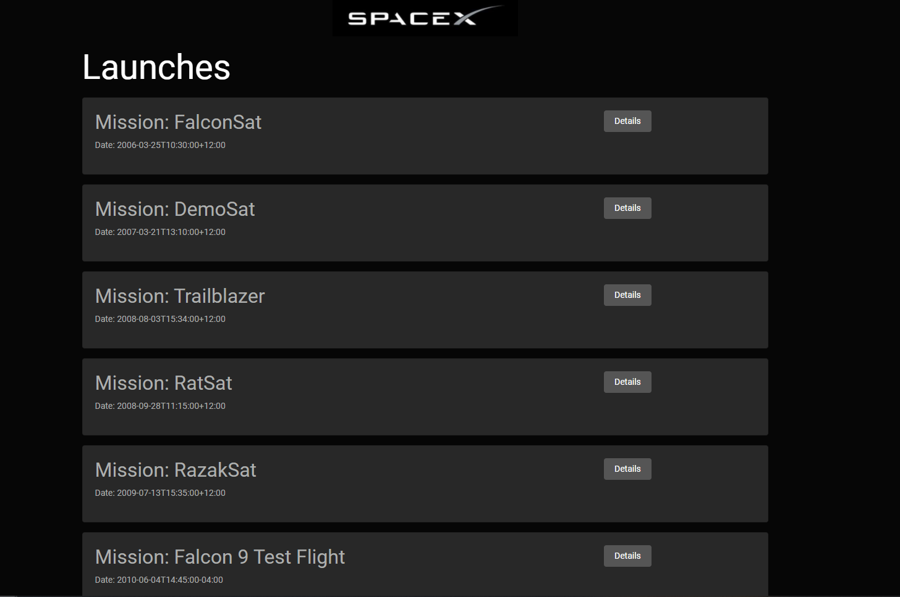

An spaceX rocket app which I created to further my knowledge with using GraphQL and Apollo Client
In this application, you will find a list of rockets that are either launched successfully by SpaceX or unsuccessfully.
Maybe....one day Elon Musk will take us all to Mars.

Built with:
React JS
GraphQL
Apollo Client
SpaceX API

To run the program:

-npm install
-npm start
